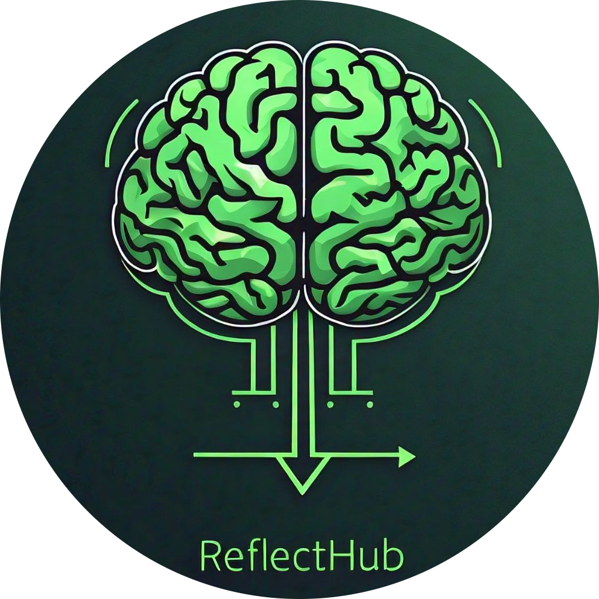

# ReflectHub - Think Rationally 

Welcome to **ReflectHub**, a web platform dedicated to showcasing videos that encourage deep reflection and understanding. The goal of this website is to present content that is rational, scientific, inspirational, and reaction-based, inviting viewers to explore different perspectives and potentially discover deeper truths.

## Overview

**ReflectHub** is designed with a focus on clarity and simplicity, ensuring that visitors can navigate content easily. The website is structured to categorize videos into meaningful sections, allowing users to explore topics that suit their interests.

## Table of Contents

1. [Website Structure](#website-structure)
2. [Categories](#categories)
3. [Contact Information](#contact-information)
4. [How to Use](#how-to-use)
5. [Acknowledgments](#acknowledgments)
6. [Additional Resources](#additional-resources)

## Website Structure

The website features the following key sections:

- **Navbar**: Displays the website's name, "Reflect," along with a logo and quick links. A centered design provides a clean and welcoming introduction to visitors.
- **Introduction Banner**: An introductory message encourages visitors to watch the videos with sincerity, urging them to reflect deeply.
- **Category Menu**: A set of buttons that allow users to filter content by categories like Rational, Scientific, Inspirational, and Reactions.
- **Content Sections**: Each category has a dedicated section displaying relevant videos in a tabular format, including details such as the title, description, and link to the video.
- **Footer**: Provides quick links to additional resources and contact options.

## Categories

Content on the website is organized into four main categories, each focusing on a specific theme:

### 1. **Rational** 🧠
   Videos that explore logical and rational arguments, helping viewers to understand deeper truths through structured reasoning.

### 2. **Scientific** 🔬
   Content related to scientific explanations and evidence, emphasizing the intersection of science and belief.

### 3. **Inspirational** ✨
   Videos meant to inspire and uplift, showcasing motivational stories and experiences.

### 4. **Reactions** 💻
   A collection of video reactions, providing different perspectives and interpretations of the topics presented.

## Contact Information

For any inquiries, suggestions, or feedback, feel free to reach out:

- **Email**: [reflect.intel@gmail.com](mailto:reflect.intel@gmail.com)
- **Instagram**: [@md_abdullah_0101](https://www.instagram.com/md_abdullah_0101/)
- **Feedback Form**: [Provide Feedback](https://forms.gle/Df9x2k9nbfRffjy59)
- **Bug Reports**: [Report Bugs](https://forms.gle/Qs7LWWRrjH3M4vZV6)
- **Discord**: blaze_0101
- **Main Github**: [@abdullah798155](https://www.github.com/abdullah798155)

## How to Use

1. **Explore Content**: Navigate through the categories using the buttons at the top of the page.
2. **Watch Videos**: Click on the titles in each category to access the videos. A short description is provided to give context.
3. **Learn More**: Visit the additional resources in the footer for further exploration.
4. **Contact & Suggest**: Use the contact information to suggest more videos or share feedback.

## Acknowledgments

I would like to acknowledge:

- The **YouTube Channels** featured for their educational and thought-provoking content.
- The **Developers and Designers** who contributed to creating a user-friendly and visually appealing website.
- Special thanks to individuals who have provided feedback and suggestions, helping to improve the website's content and design.

## Additional Resources

For those interested in further exploration:

- [Quran.com](https://www.quran.com): A comprehensive online resource for reading the Quran.
- [Scientific Miracles of the Quran](https://www.miracles-of-quran.com/index.html): A collection of articles discussing the scientific aspects found within the Quran.
